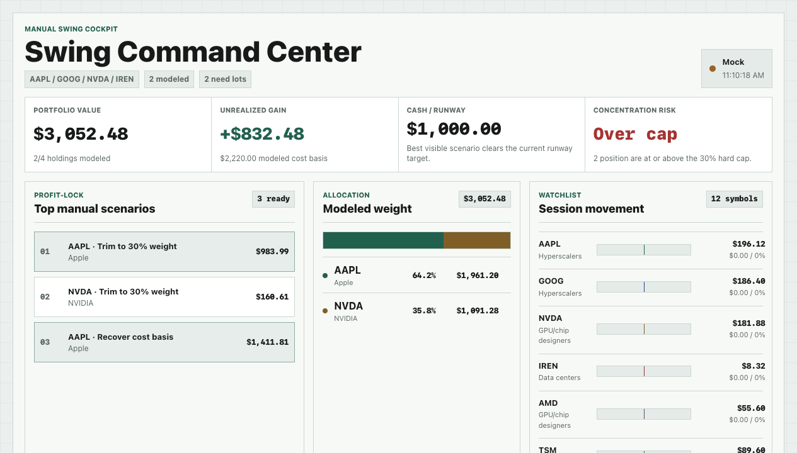
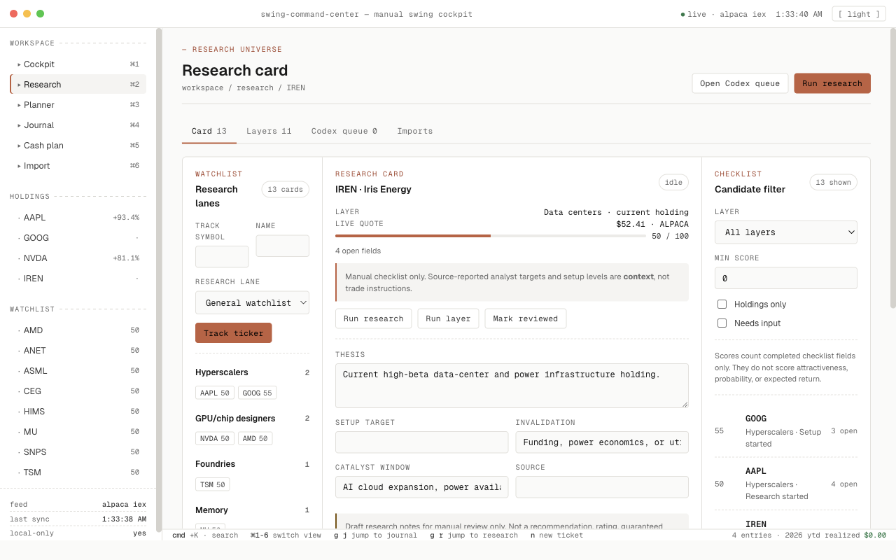
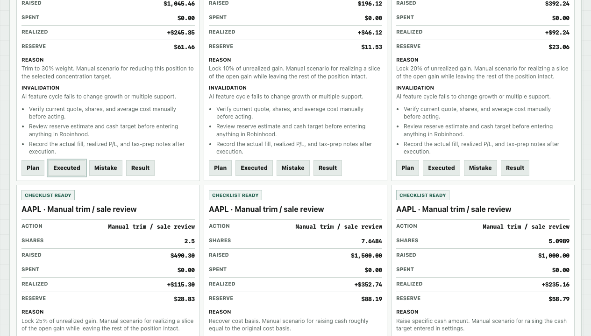

# Swing Command Center

Swing Command Center is a local-first trading dashboard I made to organize
manual swing trades.

It helps me:

- see current holdings and watchlist movement
- add the stocks I actually want to track
- enter my own shares and cost basis
- review position size and ways to lock in gains
- draft manual trade checklists
- journal planned trades, executed trades, mistakes, results, realized P/L, and
  tax notes
- plan where realized profit could go after reserve and paying myself
- queue stock research prompts for Codex or ChatGPT, then import reviewed
  research notes back into the dashboard

It does not connect to Robinhood, store broker credentials, place orders,
automate trading, or provide tax advice. Everything is for manual planning and
review.

## Screenshots







## Install

```bash
npm install
```

## Run

```bash
npm run dev
```

Open the local URL Vite prints, usually:

```text
http://127.0.0.1:5173/
```

## Optional Market Data

The app can run with mock quotes. To use Alpaca Market Data locally, create a
`.env.local` file:

```bash
VITE_MARKET_DATA_MODE=auto
VITE_ALPACA_MARKET_DATA_FEED=iex
ALPACA_MARKET_DATA_API_KEY_ID=your_key
ALPACA_MARKET_DATA_SECRET_KEY=your_secret
```

Do not commit `.env.local`.

## How I Use It

1. Start in Cockpit to review portfolio value, unrealized P/L, cash runway,
   concentration, watchlist movement, and manual tickets.
2. Use Research to move through layer watchlists, source-backed cards, candidate
   filters, and the Codex queue.
3. Use Planner to enter holdings/lots, draft target/stop scenarios, and convert
   them into manual profit-lock tickets.
4. Use Journal to filter planned trades, executed trades, mistakes, results,
   realized P/L, and tax notes.
5. Use Cash plan to review realized profit, reserve, pay-myself, and redeploy
   distribution.
6. Use Import to preview Robinhood CSV rows, review matches, reconcile totals,
   and apply accepted sell fills.
7. Export journal data when I want a tax review summary.

## Checks

```bash
npm run lint
npm run typecheck
npm test
npm run build
```
